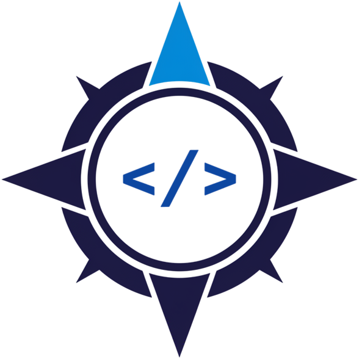

<div align="center">
    
    &nbsp;&nbsp;&nbsp;&nbsp;&nbsp;&nbsp;
    
</div>

# Codebase Compass by Fractalcode

**Codebase Compass** is a Python CLI tool that visually compares two codebases to detect drift and maintain consistency. It generates a single text file (`.txt`) that clearly displays the structural and content differences between a base project (the "source of truth") and a target implementation.

Its primary purpose is to provide developers with a clear, actionable report to easily identify discrepancies, manage updates, and ensure that different project instances remain synchronized with their original framework or boilerplate.

## Features

*   **Deep Content Comparison**: By default, compares files efficiently first by size, then by SHA-256 hash to accurately detect any modifications.
*   **Three-State Visual Tree**: Generates an intuitive directory tree using clear icons to represent the status of each file and folder:
    *   `✅` **Identical**: The file/directory exists and its content is identical.
    *   `⚠️` **Modified**: The file exists but its content has changed.
    *   `❌` **Missing**: The file/directory from the base project is missing in the target.
*   **Comprehensive Summary**: The output includes a high-level summary with totals, percentages, and a visual bar chart (`🟩🟨🟥`) to quickly assess the overall project drift.
*   **Highly Configurable**: Uses a `config.json` file to easily define the base and target paths, and to exclude specific directories, files, or extensions.
*   **Quick Scan Mode**: Includes a `--quick-scan` flag to perform a faster comparison that only checks for the existence of files, skipping the content analysis.

## Prerequisites

*   Python 3.x
*   Git (Recommended for version control, but not required for the tool to run)

## Installation and Setup

Follow these steps to set up the environment and prepare the tool for use.

1.  **Clone the repository:**
    ```bash
    git clone git@github.com:fractalcode-mx/codebase-compass.git
    cd codebase-compass
    ```

2.  **Create and activate a virtual environment:**
    This isolates the project's dependencies.
    ```bash
    # Create the environment
    python -m venv .venv

    # Activate on Windows (PowerShell/VSCode Terminal)
    .venv\Scripts\activate

    # Activate on Linux/macOS
    # source .venv/bin/activate
    ```

3.  **Install dependencies:**
    The `requirements.txt` file contains all the necessary libraries.
    ```bash
    pip install -r requirements.txt
    ```

4.  **Configure the projects to compare:**
    a. Copy the configuration template:
    ```bash
    # On Windows
    copy config.template.json config.json

    # On Linux/macOS
    # cp config.template.json config.json
    ```
    b. Open `config.json` and edit the values. The most important fields are `base_project_path` and `target_project_path`.

    ```json
    {
        "base_project_path": "C:/path/to/your/framework-base",
        "target_project_path": "C:/path/to/your/project-instance",
        "ignored_patterns": [
            "node_modules",
            "vendor",
            ".venv",
            "venv",
            ".git",
            ".vscode",
            ".DS_Store",
            "composer.lock",
            "output"
        ],
        "ignored_file_extensions": [
            ".jpg", ".jpeg", ".png", ".gif", ".bmp", ".svg", ".ico",
            ".woff", ".woff2", ".ttf", ".otf", ".eot",
            ".zip", ".tar", ".gz", ".rar", ".7z",
            ".pdf", ".doc", ".docx", ".xls", ".xlsx", ".ppt", ".pptx",
            ".psd", ".ai", ".sketch",
            ".db", ".sqlite",
            ".md", ".map"
        ]
    }
    ```

## Usage

Once configured, you can generate a comparison report with the following commands.

#### Deep Comparison (Default Behavior)

Run the script without arguments to perform a full comparison of file contents.

```bash
python src/compass_analyzer.py